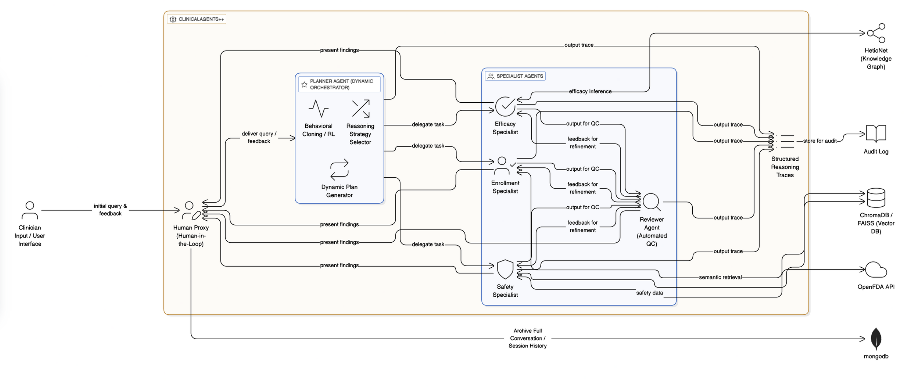

# ClinicalAgents 

**ClinicalAgents** is an advanced AI-powered multi-agent system designed to revolutionize how healthcare professionals and researchers interact with clinical trial data and drug safety information. By leveraging state-of-the-art Large Language Models (LLMs) and a LangGraph orchestration framework, it automates complex tasks such as trial enrollment analysis, drug safety assessment, and clinical trial discovery.



## Key Features

### ClinicalAgent 2.0 - LangGraph Workflow
- **Intelligent Agent Orchestration**: Built on LangGraph for robust, stateful multi-agent workflows
- **Enrollment Agent**: Smart patient-to-trial matching using ChromaDB vector search and ML-based success prediction
- **Safety Agent**: Real-time FDA drug safety analysis with black box warnings and adverse event tracking
- **Efficacy Agent**: Neo4j graph database integration for complex trial outcome analysis
- **General Agent**: Conversational AI for general clinical trial inquiries

### Premium Chat Interface
- **Dynamic Session Management**: Create, rename, delete, and organize chat sessions with smart auto-generated titles
- **Real-time Streaming**: Live agent responses with typing indicators and smooth animations
- **Stop Generation**: Cancel ongoing responses with one click
- **Rich Markdown Rendering**: Tables, code blocks, and formatted medical insights
- **Agent Visualization**: See which specialist agents are processing your query
- **Context-Aware Conversations**: Full conversation history maintained across sessions

### Clinical Trials Browser
- **Advanced Search**: Find relevant clinical trials by disease name
- **Comprehensive Trial Details**: View trial status, phases, enrollment criteria, and outcomes
- **Real-time Data**: Pulls from extensive clinical trials database
- **Intuitive UI**: Modern, responsive design with smooth animations

### Secure & Personalized
- **JWT Authentication**: Secure user registration and login system
- **User Profiles**: Personalized settings and preferences
- **MongoDB Persistence**: All chat history and user data securely stored
- **Session Isolation**: Each user's conversations are private and isolated

## Technology Stack

### Backend (`agents_server`)
- **Framework**: FastAPI (Python 3.11+)
- **LLM**: Grok (Llama 3.3) via Groq API
- **Orchestration**: LangGraph 2.0 for advanced agent workflows
- **Databases**: 
  - MongoDB (User data, chat sessions, audit logs)
  - ChromaDB Cloud (Enrollment vector search)
  - Neo4j AuraDB (Efficacy graph analytics)
  - FAISS (Local vector indices)
- **External APIs**: ClinicalTrials.gov, openFDA
- **Machine Learning**: Custom ML models for trial success prediction

### Frontend (`client`)
- **Framework**: Next.js 16 (React 19)
- **Styling**: Tailwind CSS 4 with custom design system
- **Animations**: Framer Motion for premium UI interactions
- **UI Components**: Heroicons, Lucide React
- **HTTP Client**: Axios
- **Markdown**: React Markdown with GFM support

## Project Structure

```
ClinicalAgent/
├── agents_server/              # Python FastAPI Backend
│   ├── agents/                 # Specialized AI Agents
│   │   ├── enrollment_agent.py
│   │   ├── safety_agent.py
│   │   ├── efficacy_agent.py
│   │   └── general_agent.py
│   ├── langgraph_v2/           # LangGraph 2.0 Workflow
│   │   ├── workflow.py         # Main orchestration logic
│   │   ├── state.py            # State management
│   │   ├── tools.py            # Agent tools
│   │   └── config.py           # Workflow configuration
│   ├── storage/                # Database connectors
│   ├── ml_models/              # ML prediction models
│   ├── datasets/               # Clinical trial datasets
│   ├── app.py                  # FastAPI application
│   ├── chatbot.py              # Chat logic controller
│   └── auth.py                 # Authentication & JWT
│
├── client/                     # Next.js Frontend
│   ├── app/                    # App Router Pages
│   │   ├── chat/               # Chat interface
│   │   ├── trials/             # Trials browser
│   │   └── layout.js           # Root layout
│   ├── components/             # React Components
│   │   ├── chat/               # Chat UI
│   │   ├── auth/               # Login/Register
│   │   └── ui/                 # Reusable components
│   ├── hooks/                  # Custom React hooks
│   └── services/               # API client services
│
└── docs/                       # Documentation & Assets
```

## Getting Started

For detailed installation and setup instructions, please refer to the **[SETUP.md](SETUP.md)** file.

### Quick Start

#### Prerequisites
- Python 3.11+
- Node.js 18+
- MongoDB (local or cloud)
- API Keys: Groq, ChromaDB, Neo4j (see `.env.example`)

#### Backend Setup
```bash
cd agents_server
python -m venv venv
source venv/bin/activate  # On Windows: venv\Scripts\activate
pip install -r requirements.txt
cp .env.example .env      # Configure your API keys
python app.py
```

#### Frontend Setup
```bash
cd client
npm install
npm run dev
```

Access the application at `http://localhost:3000`

## API Documentation

Once the backend is running, access the interactive Swagger UI at:
`http://localhost:8000/docs`

### Key Endpoints
- **Chat**
  - `POST /chat`: Send a message to the agent system
  - `GET /history/{session_id}`: Get message history for a session
  - `POST /chat/stop`: Stop ongoing response generation
  
- **Authentication**
  - `POST /auth/register`: Create a new user account
  - `POST /auth/login`: Authenticate a user
  - `GET /auth/me`: Get current user profile
  
- **Sessions**
  - `GET /sessions`: Retrieve user chat sessions
  - `POST /sessions`: Create a new chat session
  - `PUT /sessions/{session_id}`: Update session details
  - `DELETE /sessions/{session_id}`: Delete a chat session
  
- **Trials**
  - `GET /trials/search`: Search clinical trials by disease

## Use Cases

1. **Trial Enrollment Analysis**: "Find suitable clinical trials for Type 2 Diabetes patients"
2. **Drug Safety Research**: "What are the safety concerns for aspirin?"
3. **Efficacy Evaluation**: "Show me efficacy data for recent cancer immunotherapy trials"
4. **Trial Discovery**: Browse and search thousands of clinical trials by disease
5. **Research Organization**: Manage multiple research sessions with smart session titles

## How It Works

1. **User Query**: Type a question about clinical trials or drug safety
2. **LangGraph Routing**: The system analyzes your query and routes it to appropriate agents
3. **Agent Processing**: Specialized agents query databases, APIs, and ML models
4. **Response Generation**: AI synthesizes findings into comprehensive, actionable insights
5. **Continuous Learning**: System learns from interactions to improve future responses

## Security & Privacy

- JWT-based authentication with secure token management
- Password hashing using industry-standard algorithms
- CORS configuration for frontend-backend communication
- Environment-based configuration for sensitive credentials
- User data isolation and privacy protection

## Development

### Running Tests
```bash
# Backend
cd agents_server
pytest

# Frontend
cd client
npm test
```

### Contributing
1. Fork the repository
2. Create a feature branch (`git checkout -b feature/amazing-feature`)
3. Commit your changes (`git commit -m 'Add amazing feature'`)
4. Push to the branch (`git push origin feature/amazing-feature`)
5. Open a Pull Request

## Acknowledgments

- Built with LangGraph by LangChain
- Powered by Grok (Llama 3.3)
- Clinical trial data from ClinicalTrials.gov
- Drug safety data from openFDA

---

